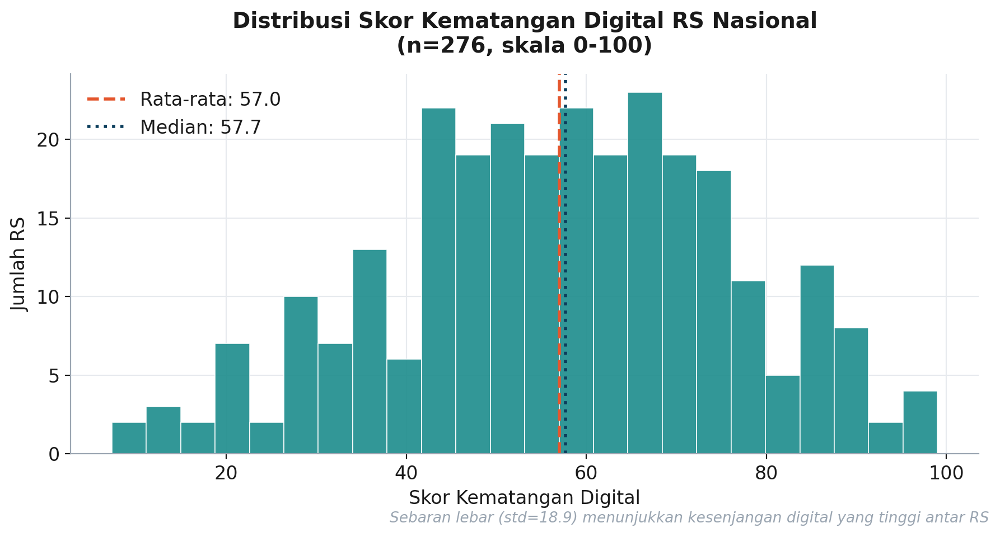
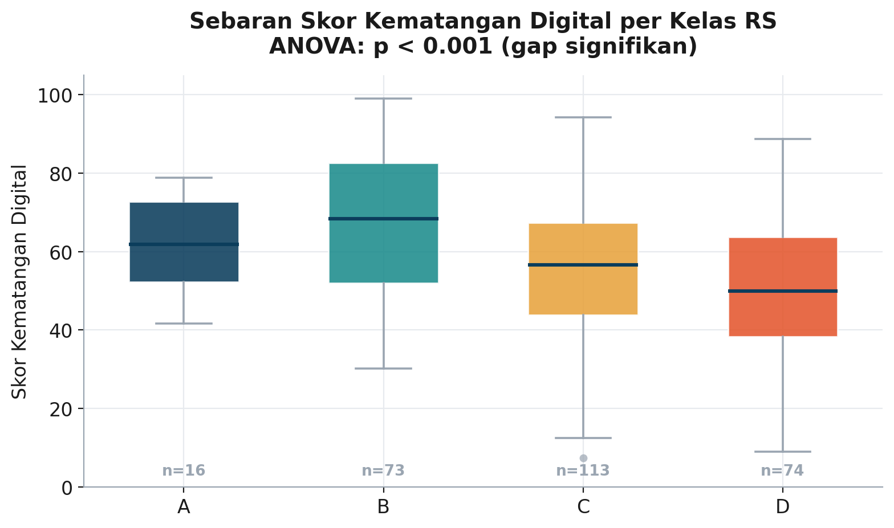
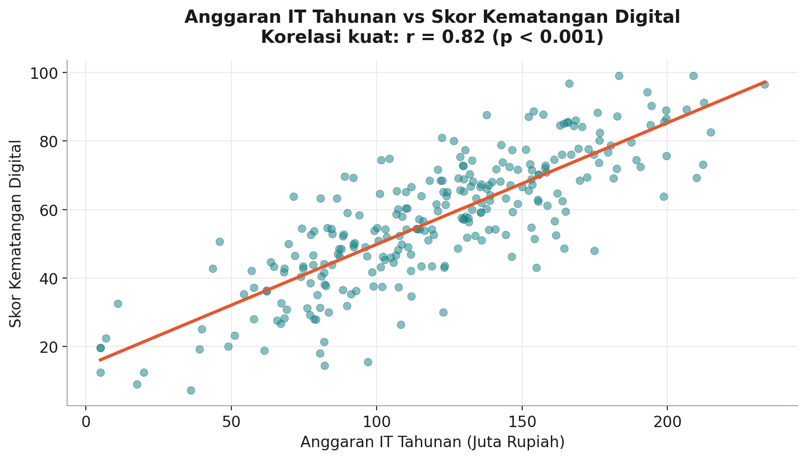
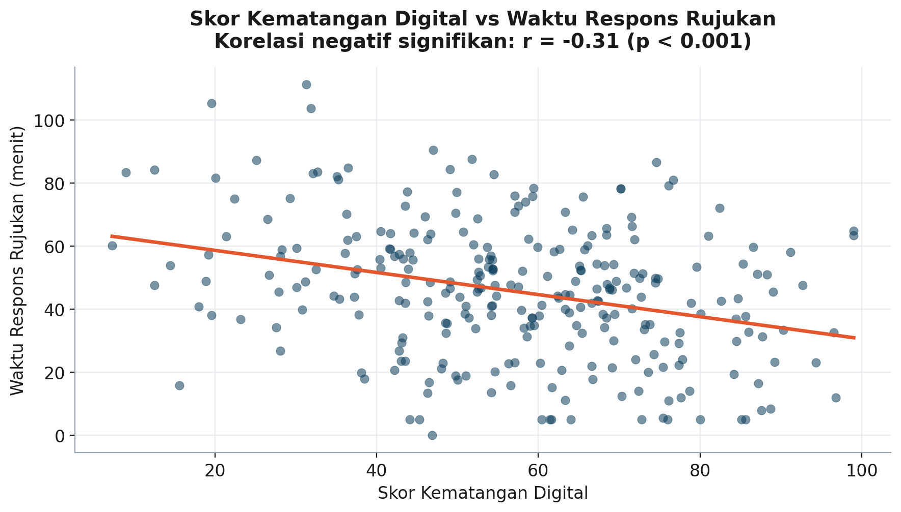
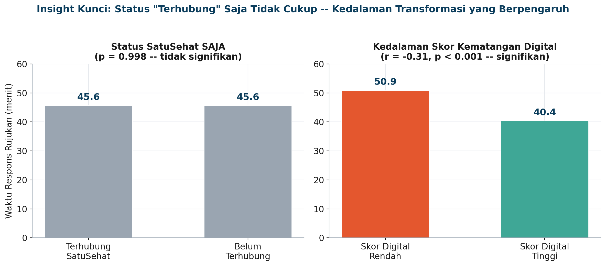
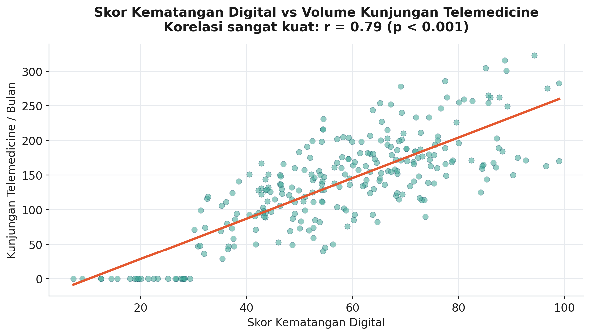
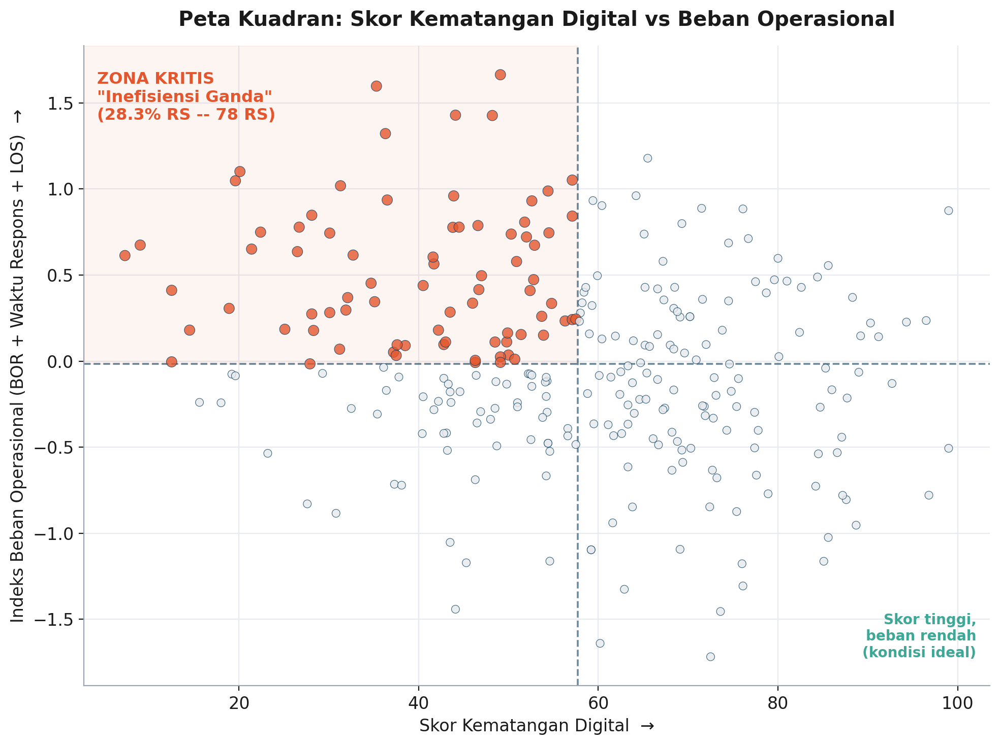
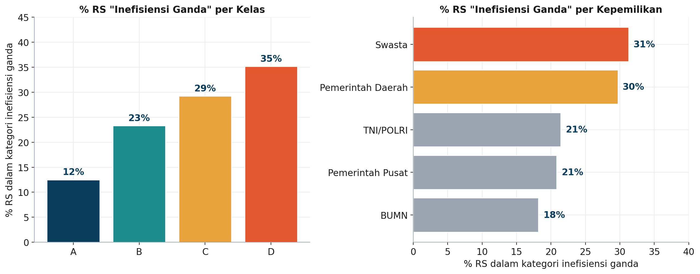
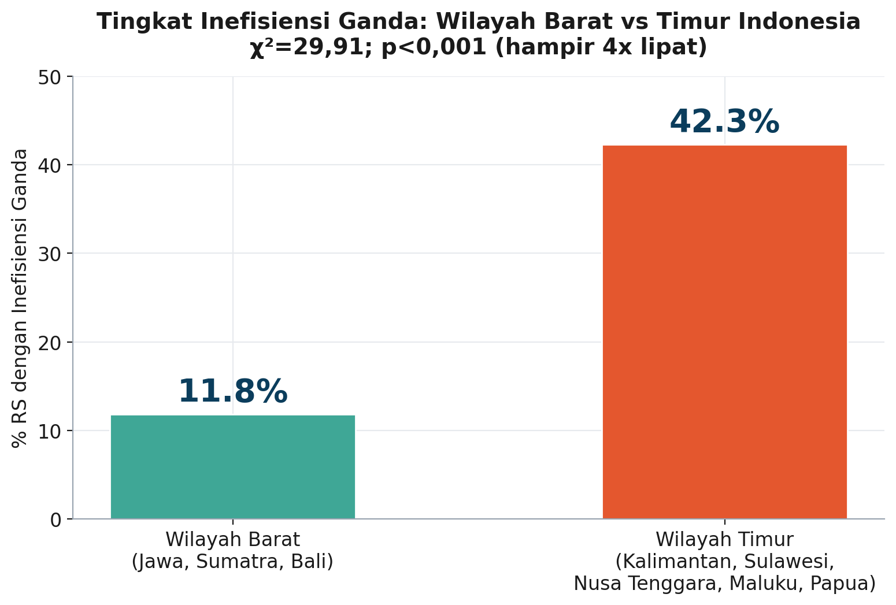

# Smart Hospital Digital Maturity Analysis

Analisis data terhadap 276 rumah sakit di Indonesia untuk mengaudit kematangan transformasi digital, mengevaluasi dampaknya terhadap efisiensi operasional, dan mengidentifikasi rumah sakit yang paling membutuhkan intervensi.

Proyek ini disusun untuk **National Data Analyst Case Competition — SYNAPSE 2026** (HIMSI Universitas Lamappapoleonro), oleh Joyce Stephanie Naibaho (Program Studi Informatika, Institut Teknologi Del).

---

## Latar Belakang

Layanan kesehatan Indonesia sedang bergerak cepat menuju digitalisasi penuh — Rekam Medis Elektronik (RME) wajib, integrasi ekosistem SatuSehat. Tapi investasi IT (anggaran, staf, perangkat IoT) belum tentu otomatis menjamin efisiensi operasional. Proyek ini membedah data untuk menjawab tiga pertanyaan strategis:

1. **Audit Kematangan Digital & Investasi** — bagaimana profil kesiapan digital RS, dan apakah anggaran IT benar-benar berkorelasi dengan skor kematangan digital?
2. **Evaluasi Dampak Operasional** — apakah RS dengan skor digital tinggi / status SatuSehat terhubung benar-benar lebih efisien secara operasional?
3. **Identifikasi Bottleneck** — RS mana yang mengalami "inefisiensi ganda" (skor digital rendah sekaligus beban operasional tinggi)?

## Executive Takeaways

- **Anggaran IT → prediktor terkuat kematangan digital** (r = 0,82; p<0,001), namun efisiensi konversinya timpang hingga 46% antar jenis kepemilikan RS.
- **Status "terhubung SatuSehat" saja TIDAK meningkatkan efisiensi operasional** (p=0,998) — yang berpengaruh signifikan adalah kedalaman skor kematangan digital (r=-0,31; p<0,001).
- **28,3% RS (78 dari 276) mengalami inefisiensi ganda** — skor digital rendah sekaligus beban operasional tinggi.
- **Disparitas geografis Barat-Timur Indonesia paling tajam dari semua faktor** — tingkat inefisiensi ganda di wilayah Timur 42,3%, hampir 4x lipat wilayah Barat (11,8%; χ²=29,91, p<0,001).

## Visualisasi Kunci

### Gambaran Umum

| Distribusi Skor Kematangan Digital Nasional |
|---|
|  |

### Pilar A — Audit Kematangan Digital & Investasi

| Sebaran Skor Digital per Kelas RS | Anggaran IT vs Skor Kematangan Digital |
|---|---|
|  |  |

### Pilar B — Evaluasi Dampak Operasional

| Skor Digital vs Waktu Respons Rujukan | Status Formal vs Kedalaman Digital (Insight Utama) |
|---|---|
|  |  |

| Skor Digital vs Volume Telemedicine |
|---|
|  |

### Pilar C — Identifikasi Bottleneck (Inefisiensi Ganda)

| Peta Kuadran Bottleneck | Proporsi Bottleneck per Kelas & Kepemilikan |
|---|---|
|  |  |

| Disparitas Wilayah Barat vs Timur |
|---|
|  |

## Metodologi

- **Data cleaning**: standardisasi kategori (whitespace/kapitalisasi), penanganan data tidak lengkap, identifikasi & penanganan outlier ekstrem.
- **Uji asumsi**: normalitas (Shapiro-Wilk) diperiksa sebelum interpretasi korelasi Pearson; linearitas diverifikasi via scatter plot.
- **Uji statistik**: korelasi Pearson, ANOVA satu arah, uji-t independen, uji chi-square, indeks komposit skor-z untuk analisis kuadran.
- **Tools**: Python (pandas, numpy, scipy, matplotlib).

Detail lengkap metodologi dan seluruh kode ada di [`notebooks/Smart_Hospital_Analysis.ipynb`](notebooks/Smart_Hospital_Analysis.ipynb).

## Struktur Repository

```
smart-hospital-digital-maturity-analysis/
├── README.md
├── requirements.txt
├── notebooks/
│   └── Smart_Hospital_Analysis.ipynb         
├── data/
│   └── dataset_smart_hospital_indonesia.csv
├── docs/
│   └── Study_Case_Smart_Hospital.pdf   # Brief/soal asli dari panitia
├── reports/
│   ├── executive_summary.pdf   
│   └── slide_presentation.pptx 
└── figures/
    └── *.png                   # Chart hasil analisis
```

## Cara Menjalankan

```bash
git clone https://github.com/<username>/smart-hospital-digital-maturity-analysis.git
cd smart-hospital-digital-maturity-analysis
pip install -r requirements.txt
jupyter notebook notebooks/Smart_Hospital_Analysis.ipynb
```

Notebook otomatis mendeteksi lokasi dataset (`data/dataset_smart_hospital_indonesia.csv`) selama struktur folder di atas tidak diubah. Jika dijalankan di Google Colab, notebook akan menampilkan dialog upload jika dataset belum tersedia di sesi tersebut.

## Deliverables

| Berkas | Deskripsi |
|---|---|
| [`reports/executive_summary.pdf`](reports/executive_summary.pdf) | Ringkasan eksekutif: Pendahuluan, Identifikasi Masalah, Metode Analisis, Hasil Analisis, Insight Utama, Rekomendasi Solusi, Kesimpulan |
| [`reports/slide_presentation.pptx`](reports/slide_presentation.pptx) | Slide presentasi 10 slide |
| [`notebooks/Smart_Hospital_Analysis.ipynb`](notebooks/Smart_Hospital_Analysis.ipynb) | Source code lengkap analisis (Python) |

## Penulis

**Joyce Stephanie Naibaho**

Program Studi Informatika, Institut Teknologi Del

National Data Analyst Case Competition — SYNAPSE 2026
